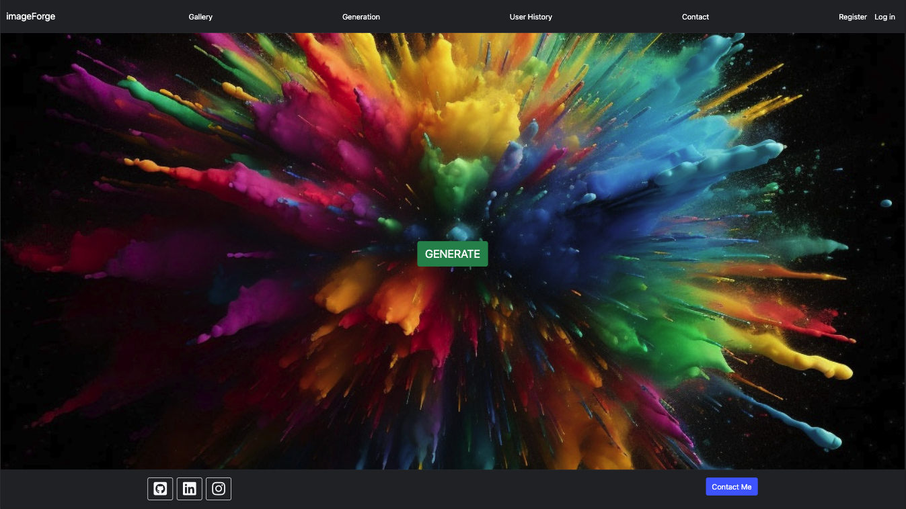

# imageForge - Full-Stack Django Web App

## Project Overview
This is a full-stack Django web application integrates the OpenAI API by using the ChatGPT 3.5 Turbo and DALL-E 2 Models to generate random and unique artwork.

## Deployment Link
This project is live! Check it out [here](https://imageforgelive-e87a9f628780.herokuapp.com/).

## Screenshot

 
 

## Table of Contents
- [Purpose](#purpose)
- [Tech Stack](#tech-stack)
- [Build Steps](#build-steps)
- [Design Goals](#design-goals)
- [Project Features](#project-features)
- [Known Issues](#known-issues)
- [Additions & Improvements](#additions)
- [Learning Highlights](#learning-highlights)
- [Change Logs](#change-logs)
- [Challenges](#challenges)

## Purpose / Requirements / Goals
MVP
Desired Result

## Tech Stack
List technologies

## Build Steps 
How to build / run project
Use code proper code snippets for commands to run

## Design Goals
Decisions about project design

## Project Features
  - specific project features

## Known Issues
Remaining bugs of features needing improvement

## Additions & Improvements
Desired future features for the application

## Learning Highlights
What new skills and expertise this project conferred

## Change Logs
List of dates and features worked on

## Challenges

Thanks for your interest, feel free to reach out with any questions.

Created by Oliver Jenkins © 2024

