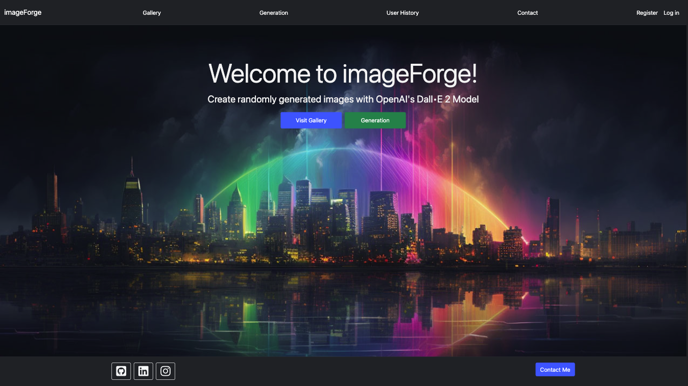
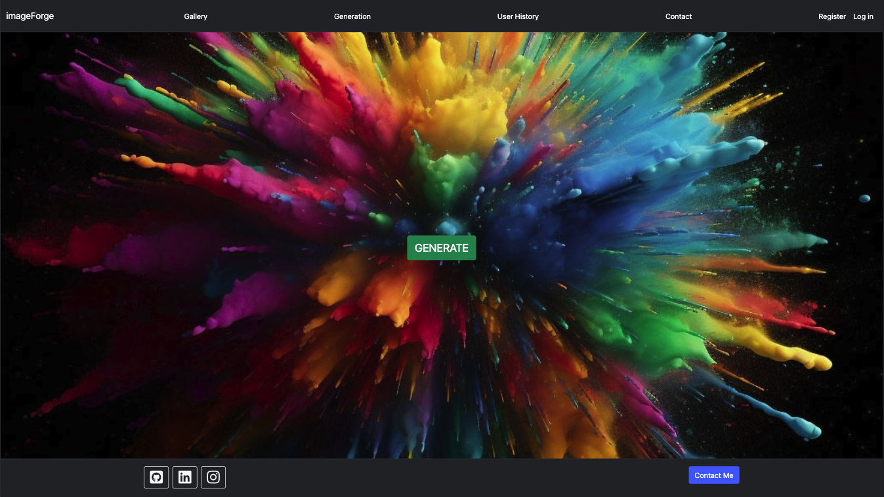

# imageForge - Django Web App using OpenAI API

## Project Overview
This is a full-stack Django-based web application that integrates ChatGPT 3.5 Turbo and DALL-E 2 APIs to generate random and unique artwork.

## Deployment Link
This project is live! Check it out [here](https://imageforgelive-e87a9f628780.herokuapp.com/).

## Screenshot

 
 

## How to Use

To create an image, users navigate to the generation page and click 'generate', then convert the unique prompt into visual art, which can be viewed in a public gallery or a private history if logged in.

## Revoked keys

- in settings.py
    - SECRET_KEY
    - AWS_ACCESS_KEY_ID
    - AWS_SECRET_ACCESS_KEY
    - AWS_STORAGE_BUCKET_NAME

- in .env
    - OPENAI_API_KEY
    - SECRET_KEY

## Notes 
 - talk about 'debug = True'

## To-do List

- post images to IG

- ensure mobile responsive design

- set a hard limit for number of images generated
  - openAI and other

- refactor css and javascript code from templates into static folder

- fix contact me button

- add a download link to images

## Start-up checklist

...

## Useful commands

source venv/bin/activate

pip install -r requirements.txt

python manage.py runserver
